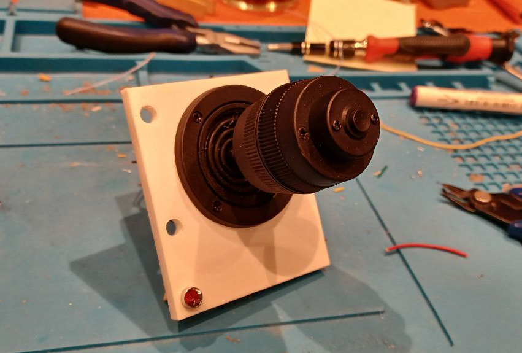
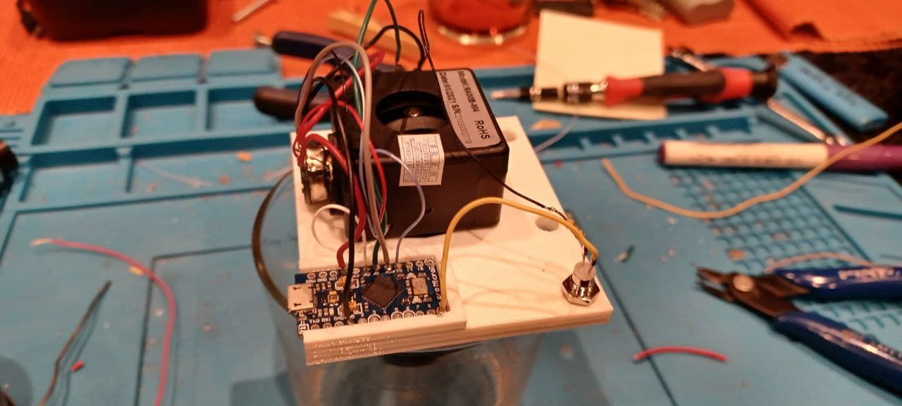
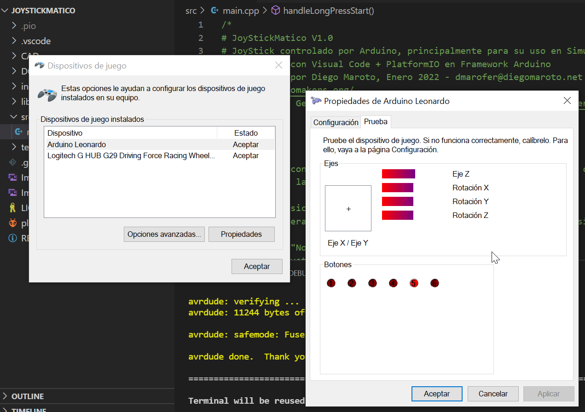

# JoyStickMatico V1.0
JoyStick controlado por Arduino, principalmente para su uso en Simuladores (Farming Simulator)

Desarrollado con Visual Code + PlatformIO en Framework Arduino

Desarrollado por Diego Maroto, Enero 2022 - dmarofer@diegomaroto.net

https://bilbaomakers.org/

Licencia: GNU General Public License v3.0 - https://www.gnu.org/licenses/gpl-3.0.html

Desarrollado con la idea de multiplicar el numero de ejes y botones cuando es necesario tenerlos pero no
utilizarlos a la vez.

El control fisico dispone de un JoyStick de 3 ejes y un boton

Al Sistema operativo le presenta 6 ejes y 6 botones que funcionan Asi

MODO 1 (Modo "Normal" - led apagado)
  - Con el Joystick movemos los ejes logicos X,Y,Z
  - Con el boton click sencillo se hace click en el boton logico 1
  - Con el boton doble click se hace click en el boton logico 2
  - Con el boton triple click se alterna el estado del boton logico 3

MODO 2 (Modo "Shift" - led encendido)
  - Con el Joystick movemos los ejes logicos RX,RY,RZ
  - Con el boton click sencillo se hace click en el boton logico 4
  - Con el boton doble click se hace click en el boton logico 5
  - Con el boton triple click se alterna el estado del boton logico 6

Haciendo HOLD (pulsado mas del tiempo configurado) el boton se alterna el modo de trabajo.

Fuera del modo los ejes logicos presentan estado centrado (0,0,0)

